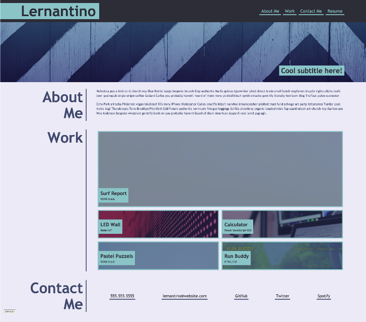
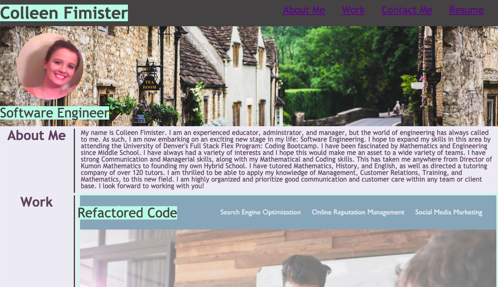
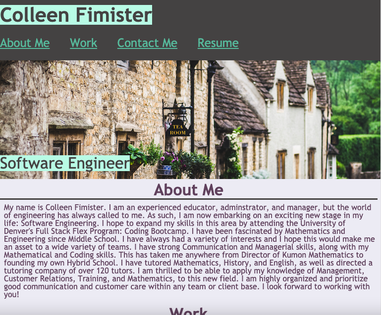
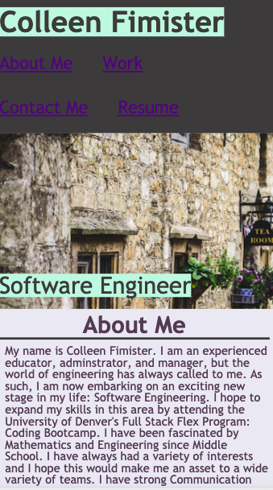

# Portfolio

## Description

- What was my motivation? I needed a Portfolio to display my coding knowledge.
- Why did I build this project? I built this project to better understand the logic behind Responsive Design, as well as how to use CSS to style a page, and finally to create a place to display my current and future projects.
- What problem does it solve? This Portfolio provides a place for employers to view my work.
- What did I learn? I learned about Responsive Design and CSS properties

## Table of Contents

- [Installation](#installation)
- [Usage](#usage)
- [Credits](#credits)
- [License](#license)
- [Links](#links)

## Installation

Although this is simply a webpage displaying my Portfolio and no installation is necessary, there were certain criteria that had to be met in order to complete this project:

    User Story
    AS AN employer
    I WANT to view a potential employee's deployed portfolio of work samples
    SO THAT I can review samples of their work and assess whether they're a good candidate for an open position

    Acceptance Criteria
    Here are the critical requirements necessary to develop a portfolio that satisfies a typical hiring manager’s needs:
    GIVEN I need to sample a potential employee's previous work
    WHEN I load their portfolio
    THEN I am presented with the developer's name, a recent photo or avatar, and links to sections about them, their work, and how to contact them
    WHEN I click one of the links in the navigation
    THEN the UI scrolls to the corresponding section
    WHEN I click on the link to the section about their work
    THEN the UI scrolls to a section with titled images of the developer's applications
    WHEN I am presented with the developer's first application
    THEN that application's image should be larger in size than the others
    WHEN I click on the images of the applications
    THEN I am taken to that deployed application
    WHEN I resize the page or view the site on various screens and devices
    THEN I am presented with a responsive layout that adapts to my viewport

### Mock-Up

Although we were free to use some creativity, DU's Coding Bootcamp provided a Mock Up of the general styling attributes they would want us to use in this project.

## Usage
- Please see below for examples of this webpage, which demonstrate its responsive design:

## Credits
- https://unsplash.com/@forhiskingdom
- https://du.bootcampcontent.com/denver-coding-bootcamp/du-den-virt-fsf-pt-08-2021-u-c/-/tree/master/02-Advanced-CSS/02-Homework
- https://coding-boot-camp.github.io/full-stack/github/professional-readme-guide

## License
© 2021 Trilogy Education Services, LLC, a 2U, Inc. brand. Confidential and Proprietary. All Rights Reserved.

## Links
[Live Link](https://carlincb.github.io/Portfolio/)

[GitHub Link](https://github.com/carlincb/Portfolio)