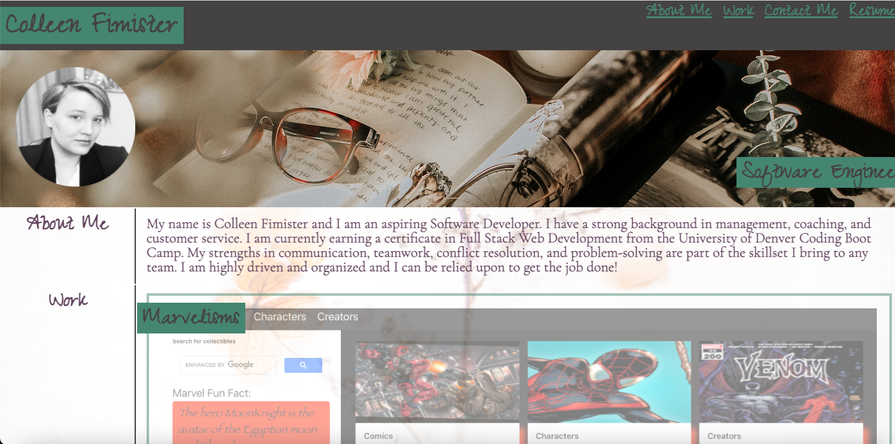
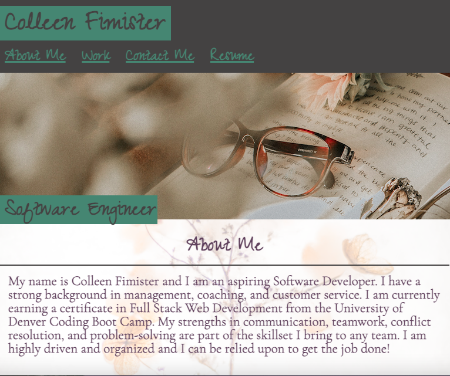
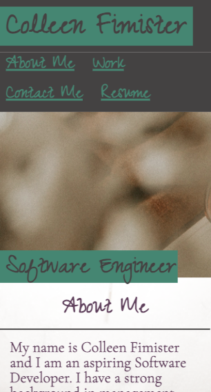

# Portfolio

## Description

- What was my motivation? I needed a Portfolio to display my coding knowledge.
- Why did I build this project? I built this project to better understand the logic behind Responsive Design, as well as how to use CSS to style a page, and finally to create a place to display my current and future projects.
- What problem does it solve? This Portfolio provides a place for employers to view my work.
- What did I learn? I learned about Responsive Design and CSS properties

## Table of Contents

- [Installation](#installation)
- [Usage](#usage)
- [Credits](#credits)
- [License](#license)
- [Links](#links)
- [Contact](#contact)

## Installation

Although this is simply a webpage displaying my Portfolio and no installation is necessary, there were certain criteria that had to be met in order to complete this project:

    User Story
    AS AN employer
    I WANT to view a potential employee's deployed portfolio of work samples
    SO THAT I can review samples of their work and assess whether they're a good candidate for an open position

    Acceptance Criteria
    Here are the critical requirements necessary to develop a portfolio that satisfies a typical hiring manager’s needs:
    GIVEN I need to sample a potential employee's previous work
    WHEN I load their portfolio
    THEN I am presented with the developer's name, a recent photo or avatar, and links to sections about them, their work, and how to contact them
    WHEN I click one of the links in the navigation
    THEN the UI scrolls to the corresponding section
    WHEN I click on the link to the section about their work
    THEN the UI scrolls to a section with titled images of the developer's applications
    WHEN I am presented with the developer's first application
    THEN that application's image should be larger in size than the others
    WHEN I click on the images of the applications
    THEN I am taken to that deployed application
    WHEN I resize the page or view the site on various screens and devices
    THEN I am presented with a responsive layout that adapts to my viewport

## Usage

- Please see below for examples of this webpage, which demonstrate its responsive design:

### Desktop View

### iPad View

### iPhone View

## Credits

- https://unsplash.com/@forhiskingdom
- https://du.bootcampcontent.com/denver-coding-bootcamp/du-den-virt-fsf-pt-08-2021-u-c/-/tree/master/02-Advanced-CSS/02-Homework
- https://coding-boot-camp.github.io/full-stack/github/professional-readme-guide

## License

MIT License

Copyright (c) [2021] [Colleen Fimister]

Permission is hereby granted, free of charge, to any person obtaining a copy
of this software and associated documentation files (the "Software"), to deal
in the Software without restriction, including without limitation the rights
to use, copy, modify, merge, publish, distribute, sublicense, and/or sell
copies of the Software, and to permit persons to whom the Software is
furnished to do so, subject to the following conditions:

The above copyright notice and this permission notice shall be included in all
copies or substantial portions of the Software.

THE SOFTWARE IS PROVIDED "AS IS", WITHOUT WARRANTY OF ANY KIND, EXPRESS OR
IMPLIED, INCLUDING BUT NOT LIMITED TO THE WARRANTIES OF MERCHANTABILITY,
FITNESS FOR A PARTICULAR PURPOSE AND NONINFRINGEMENT. IN NO EVENT SHALL THE
AUTHORS OR COPYRIGHT HOLDERS BE LIABLE FOR ANY CLAIM, DAMAGES OR OTHER
LIABILITY, WHETHER IN AN ACTION OF CONTRACT, TORT OR OTHERWISE, ARISING FROM,
OUT OF OR IN CONNECTION WITH THE SOFTWARE OR THE USE OR OTHER DEALINGS IN THE
SOFTWARE.

## Links

[Live Link](https://carlincb.github.io/Portfolio/)

[GitHub Link](https://github.com/carlincb/Portfolio)

## Contact

Have questions? Please feel free to contact me at carlin.colleen@gmail.com.
